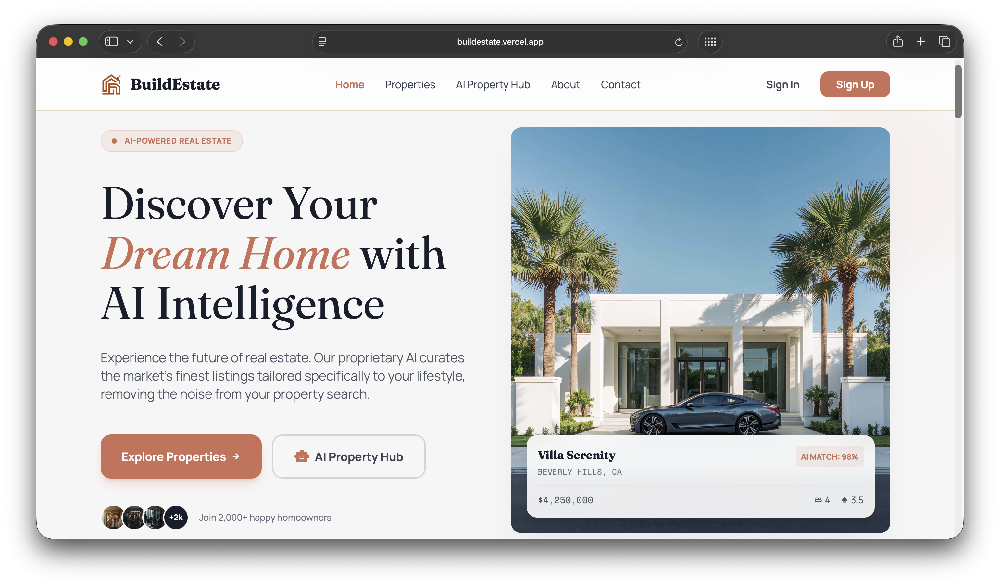
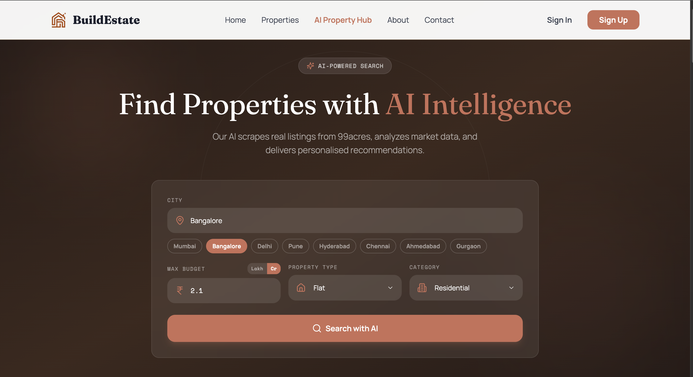
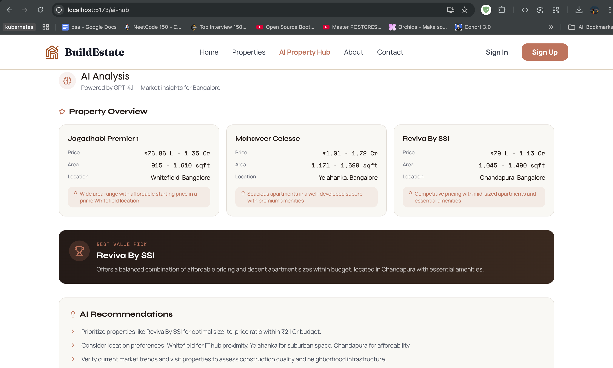
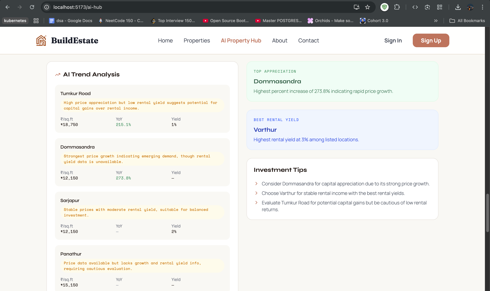
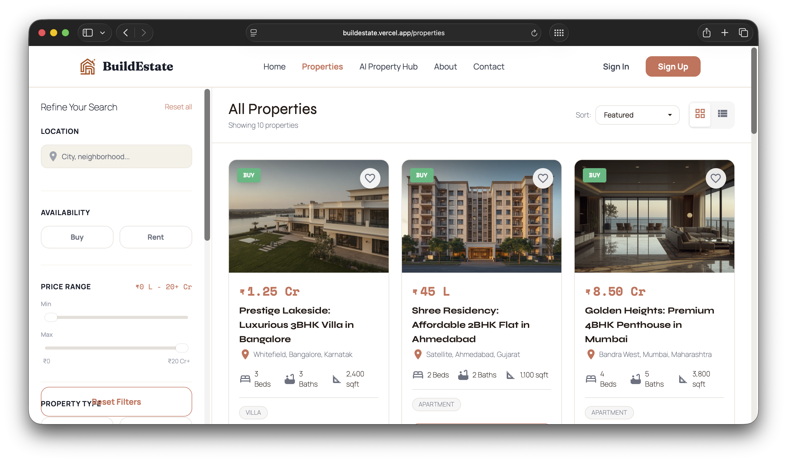

<div align="center">

  

<br/><br/>

[](https://git.io/typing-svg)

<br/>

<p><strong>A full-stack real estate platform that scrapes live property data from 99acres.com using Firecrawl, analyzes it with GPT-4.1, and serves filtered results — all with user-owned API keys.</strong></p>

<br/>

[](https://react.dev)
[](https://www.typescriptlang.org)
[](https://nodejs.org)
[](https://www.mongodb.com)
[](https://tailwindcss.com)
[](https://github.com/marketplace/models)
[](https://firecrawl.dev)

<br/>

[](https://buildestate.vercel.app)
[](https://real-estate-website-backend-zfu7.onrender.com)

<br/>

[](https://github.com/AAYUSH412/Real-Estate-Website)
[](https://github.com/AAYUSH412/Real-Estate-Website/fork)
[](LICENSE)
[](https://github.com/AAYUSH412/Real-Estate-Website/commits)
[](https://github.com/AAYUSH412/Real-Estate-Website/issues)

</div>

<br/>


## 📸 Platform Preview

<div align="center">
  
</div>

<br/>


## 📋 Table of Contents

<div align="center">

|     | Section                                          |
| :-: | :----------------------------------------------- |
| 🧠  | [Why BuildEstate?](#-why-buildestate)            |
| 🤖  | [AI Property Hub](#-ai-property-hub)             |
| 🌟  | [Features](#-features)                           |
| 🏗️  | [Architecture](#%EF%B8%8F-architecture)          |
| 💻  | [Tech Stack](#-tech-stack)                       |
| 🚀  | [Getting Started](#-getting-started)             |
| 🔌  | [API Endpoints](#-api-endpoints)                 |
| 🌐  | [Deployment](#-deployment)                       |
| 📂  | [Project Structure](#-project-structure)         |
| 🤝  | [Contributing](#-contributing)                   |
| 👨‍💻 | [Author](#-author)                               |

</div>

<br/>


## 🧠 Why BuildEstate?

Most real-estate aggregators show you generic listings. BuildEstate is different:

| Problem | BuildEstate Solution |
|---|---|
| Generic search results with no real filtering | **Deterministic 99acres URLs** — city ID + property-type slug + budget index → pre-filtered pages |
| No AI intelligence in traditional portals | **GPT-4.1 analysis** — best-value picks, investment tips, market comparison |
| API costs borne by the developer | **User-owned API keys** — users bring their own free GitHub Models + Firecrawl keys |
| Scraping returns empty/broken data | **Smart scraping via scrapeUrl + JSON format** — full browser render → LLM extraction |
| Search breaks on proxy/rate errors | **Auto-retry with exponential backoff** — proxy → rate-limit → server errors all handled |

> **TL;DR** — This is not another property listing site. It's an AI-first platform that turns raw web data into actionable real estate insights.

<br/>


## 🤖 AI Property Hub

> **The headline feature.** Search any Indian city + property type + budget → get live scraped properties with AI analysis.

<div align="center">
  
  &nbsp;&nbsp;
  
</div>

<br/>

<div align="center">
  
  &nbsp;&nbsp;
  
</div>

<br/>

### How It Works

```
┌─────────────────┐     POST /api/ai/search        ┌──────────────────┐
│                  │─────────────────────────────────▶│                  │
│   React Frontend │     X-Github-Key header         │  Express Backend │
│   (TypeScript)   │     X-Firecrawl-Key header      │   (Node.js)      │
│                  │◀─────────────────────────────────│                  │
└─────────────────┘     { properties, analysis }     └────────┬─────────┘
                                                              │
                              ┌────────────────────────────────┤
                              │                                │
                              ▼                                ▼
                   ┌─────────────────────┐        ┌─────────────────────┐
                   │   Firecrawl API     │        │   GitHub Models     │
                   │   (scrapeUrl+JSON)  │        │   (GPT-4.1-mini)   │
                   │                     │        │                     │
                   │ 1. Build 99acres    │        │ 1. Receive scraped  │
                   │    deterministic URL│        │    properties       │
                   │ 2. Full browser     │        │ 2. Analyze best     │
                   │    render (10s wait)│        │    value picks      │
                   │ 3. LLM extracts    │        │ 3. Return investment│
                   │    structured JSON  │        │    recommendations  │
                   └─────────────────────┘        └─────────────────────┘
```

### Smart URL Construction

The backend doesn't just pass a generic URL to Firecrawl. It builds **deterministic, pre-filtered** URLs:

```
User searches: "Ahmedabad + House + 50 Lakhs"
                         ↓
City ID lookup:    CITY_IDS['ahmedabad'] → 45
Property slug:     PROPERTY_TYPE_SLUGS['House'] → 'independent-house'
Budget index:      50 Lakhs → getBudgetMaxIndex(0.5) → 7
                         ↓
https://www.99acres.com/search/property/buy/independent-house/ahmedabad?city=45&budget_max=7
```

This means the scraper hits a page that **already shows filtered results** — no wasted tokens parsing irrelevant listings.

### Supported Coverage

| Category | Coverage |
|---|---|
| 🏙️ Cities | 30+ — Mumbai, Delhi, Bangalore, Pune, Chennai, Hyderabad, Ahmedabad, Kolkata, Jaipur, Lucknow, and more |
| 🏠 Property Types | Flat, House, Villa, Plot, Penthouse, Studio, Commercial |
| 💰 Budget Range | ₹5 Lakhs → ₹25+ Crores (17 budget tiers mapped to 99acres indices) |
| 🔄 Retry Logic | Auto-retry on proxy failures, rate limits (429), and server errors (502/503) |

### 🔑 User-Owned API Keys

Users provide their **own free keys** in the browser. Keys are stored in localStorage only — never on the server.

```
User's browser (localStorage)
  buildestate_github_key   = "ghp_xxx"
  buildestate_firecrawl_key = "fc-xxx"
         │
         │  X-Github-Key / X-Firecrawl-Key headers
         ▼
  Backend creates per-request service instances
  (Server env keys are NEVER used as fallback)
```

**Get your free keys in ~2 minutes:**

| Service | Link | Free Tier |
|---|---|---|
| GitHub Models (GPT-4.1) | [github.com/marketplace/models](https://github.com/marketplace/models) | Free with any GitHub account |
| Firecrawl (web scraping) | [firecrawl.dev](https://firecrawl.dev) | 500 free credits/month |

<br/>


## 🌟 Features

### 🏡 Property Browsing & Booking

> Rich filters, detailed galleries (up to 4 images per property via ImageKit CDN), and instant appointment scheduling.

<div align="center">
  
</div>

<br/>

<div align="center">

| Feature | Description |
| :-----: | :--- |
| 🔎 | Advanced filter sidebar — price, type, location, area, amenities |
| 🖼️ | Multi-image gallery delivered via ImageKit CDN |
| 📅 | Appointment booking — works for both guest and authenticated users |
| 🔐 | JWT authentication with bcrypt hashing + email-based password reset |
| 🎨 | Fluid page transitions powered by Framer Motion |
| 🔍 | SEO-optimized — structured data, sitemap, robots.txt, per-page meta tags |

</div>

<br/>

### 📊 Admin Dashboard

> Full control — manage listings, track appointments, monitor analytics, and upload images with drag-and-drop.

<div align="center">

| Capability | Description |
| :--------: | :--- |
| ➕ | Add / Edit / Delete property listings with multi-image upload |
| 📅 | Appointment management with status updates & meeting link generation |
| 📈 | Real-time analytics dashboard with Chart.js visualizations |
| 👥 | User management and platform activity monitoring |

</div>

<br/>


## 🏗️ Architecture

```
┌──────────────────────────────────────────────────────────────────────────────┐
│                              CLIENT LAYER                                    │
├─────────────────────────┬────────────────────────────────────────────────────┤
│  Frontend (Vercel)      │  Admin Panel (Render)                              │
│  React 18 + TypeScript  │  React 18 + JavaScript                            │
│  Tailwind CSS v4        │  Tailwind CSS v3 + Chart.js                        │
│  Vite 6 + React Router  │  Vite 6                                            │
│  Framer Motion          │  Sonner notifications                              │
└────────────┬────────────┴──────────────┬─────────────────────────────────────┘
             │ HTTPS (Axios)             │ HTTPS (Axios)
             ▼                           ▼
┌──────────────────────────────────────────────────────────────────────────────┐
│                           API LAYER (Render)                                 │
│  Express.js + Helmet + CORS + Rate Limiter                                   │
├──────────────────────────────────────────────────────────────────────────────┤
│  Routes:  /api/users  /api/products  /api/appointments  /api/ai  /api/forms │
│  Middleware: JWT auth · Multer uploads · Request transform · Stats tracking  │
├──────────┬───────────────┬──────────────────┬────────────────────────────────┤
│          │               │                  │                                │
│          ▼               ▼                  ▼                                │
│  ┌──────────────┐ ┌────────────┐  ┌─────────────────┐                       │
│  │ MongoDB Atlas│ │ ImageKit   │  │ Firecrawl API   │                       │
│  │ (Database)   │ │ (CDN)      │  │ (Web Scraping)  │                       │
│  └──────────────┘ └────────────┘  └────────┬────────┘                       │
│                                            │                                │
│                                            ▼                                │
│                                   ┌─────────────────┐                       │
│                                   │ GitHub Models    │                       │
│                                   │ (GPT-4.1-mini)  │                       │
│                                   └─────────────────┘                       │
├──────────────────────────────────────────────────────────────────────────────┤
│  Services: Nodemailer (Brevo SMTP) · bcrypt hashing · In-memory cache (10m) │
└──────────────────────────────────────────────────────────────────────────────┘
```

<br/>


## 💻 Tech Stack

<div align="center">

### Frontend
[](https://react.dev)
[](https://www.typescriptlang.org)
[](https://vitejs.dev)
[](https://tailwindcss.com)
[](https://www.framer.com/motion)
[](https://reactrouter.com)

### Backend
[](https://nodejs.org)
[](https://expressjs.com)
[](https://www.mongodb.com)
[](https://jwt.io)
[](https://nodemailer.com)

### AI & Infrastructure
[](https://github.com/marketplace/models)
[](https://firecrawl.dev)
[](https://imagekit.io)
[](https://vercel.com)
[](https://render.com)

</div>

<br/>


## 🚀 Getting Started

### Prerequisites

- [Node.js](https://nodejs.org/) 18+ and npm 8+
- [MongoDB Atlas](https://www.mongodb.com/cloud/atlas) free account
- [ImageKit](https://imagekit.io/) free account
- [Brevo](https://www.brevo.com/) free SMTP account

### 1. Clone the Repository

```bash
git clone https://github.com/AAYUSH412/Real-Estate-Website.git
cd Real-Estate-Website
```

<details>
<summary><strong>⚙️ 2. Backend Setup</strong></summary>

<br/>

```bash
cd backend
npm install
cp .env.example .env.local
```

Edit `backend/.env.local`:

```env
PORT=4000
NODE_ENV=development

# MongoDB Atlas
MONGO_URI=mongodb+srv://<user>:<pass>@<cluster>.mongodb.net/?retryWrites=true&w=majority

# JWT — generate with: openssl rand -hex 32
JWT_SECRET=your_jwt_secret_here

# Brevo SMTP
SMTP_USER=your_smtp_login
SMTP_PASS=your_smtp_password
EMAIL=your_sender_email@gmail.com

# Admin credentials
ADMIN_EMAIL=admin@yourdomain.com
ADMIN_PASSWORD=your_admin_password

# Frontend URL (for CORS + password reset emails)
WEBSITE_URL=http://localhost:5173

# ImageKit
IMAGEKIT_PUBLIC_KEY=your_imagekit_public_key
IMAGEKIT_PRIVATE_KEY=your_imagekit_private_key
IMAGEKIT_URL_ENDPOINT=https://ik.imagekit.io/your_id
```

```bash
npm run dev   # http://localhost:4000
```

</details>

<details>
<summary><strong>🖥️ 3. Frontend Setup</strong></summary>

<br/>

```bash
cd ../frontend
npm install
cp .env.example .env.local
```

Edit `frontend/.env.local`:

```env
VITE_API_BASE_URL=http://localhost:4000
VITE_ENABLE_AI_HUB=true
```

```bash
npm run dev   # http://localhost:5173
```

</details>

<details>
<summary><strong>🛠️ 4. Admin Panel Setup</strong></summary>

<br/>

```bash
cd ../admin
npm install
cp .env.example .env.local
```

Edit `admin/.env.local`:

```env
VITE_BACKEND_URL=http://localhost:4000
```

```bash
npm run dev   # http://localhost:5174
```

</details>

<br/>


## 🔌 API Endpoints

<details>
<summary><strong>🔐 Authentication & Users</strong></summary>

<br/>

| Method | Endpoint | Description |
|---|---|---|
| POST | /api/users/register | Register new user |
| POST | /api/users/login | Login (returns JWT) |
| POST | /api/users/admin | Admin login |
| GET | /api/users/me | Get current user (JWT required) |
| POST | /api/users/forgot | Send password reset email |
| POST | /api/users/reset/:token | Reset password |

</details>

<details>
<summary><strong>🏠 Properties</strong></summary>

<br/>

| Method | Endpoint | Description |
|---|---|---|
| GET | /api/products/list | List all properties |
| GET | /api/products/single/:id | Get property by ID |
| POST | /api/products/add | Add property with images (admin) |
| POST | /api/products/update | Update property (admin) |
| POST | /api/products/remove | Delete property (admin) |

</details>

<details>
<summary><strong>📅 Appointments</strong></summary>

<br/>

| Method | Endpoint | Description |
|---|---|---|
| POST | /api/appointments/schedule | Book viewing (guest) |
| POST | /api/appointments/schedule/auth | Book viewing (logged in) |
| GET | /api/appointments/user | Get appointments by email |
| PUT | /api/appointments/cancel/:id | Cancel appointment |
| GET | /api/appointments/all | All appointments (admin) |
| PUT | /api/appointments/status | Update status (admin) |
| PUT | /api/appointments/update-meeting | Add meeting link (admin) |

</details>

<details>
<summary><strong>🤖 AI & Other Services</strong></summary>

<br/>

| Method | Endpoint | Description |
|---|---|---|
| POST | /api/ai/search | AI property search (requires user API keys) |
| GET | /api/locations/:city/trends | Location market trends (requires user API keys) |
| POST | /api/forms/submit | Contact form submission |
| GET | /api/admin/stats | Dashboard statistics (admin) |

</details>

<br/>


## 🌐 Deployment

<details>
<summary><strong>▲ Frontend on Vercel</strong></summary>

<br/>

1. Import repo in [Vercel](https://vercel.com)
2. Set **Root Directory** → `frontend`
3. Add env vars:
   - `VITE_API_BASE_URL` = your Render backend URL
   - `VITE_ENABLE_AI_HUB=true`
4. Deploy

</details>

<details>
<summary><strong>🟢 Backend & Admin on Render</strong></summary>

<br/>

**Backend Web Service:**
1. Create a **Web Service** on [Render](https://render.com)
2. Set **Root Directory** → `backend`
3. Build: `npm install` | Start: `npm start`
4. Add all env vars from `backend/.env.example`
5. Set `NODE_ENV=production` and `WEBSITE_URL` to your Vercel frontend URL

**Admin Panel:**
Same steps with **Root Directory** → `admin` and `VITE_BACKEND_URL` = your Render backend URL.

</details>

<details>
<summary><strong>✅ Deployment Checklist</strong></summary>

<br/>

- [ ] MongoDB Atlas cluster created and connection string added
- [ ] ImageKit account created (for property images)
- [ ] Brevo SMTP credentials added (for email notifications)
- [ ] JWT_SECRET set to a random 32-byte hex string
- [ ] ADMIN_EMAIL and ADMIN_PASSWORD set
- [ ] WEBSITE_URL points to your Vercel frontend
- [ ] VITE_ENABLE_AI_HUB=true set in frontend env vars
- [ ] VITE_API_BASE_URL points to your Render backend

</details>

<br/>


## 📂 Project Structure

<details>
<summary><strong>View Full Directory Tree</strong></summary>

<br/>

```text
Real-Estate-Website/
├── frontend/          → User-facing website (React + TypeScript + Vite)
├── admin/             → Admin dashboard (React + Vite)
├── backend/           → REST API server (Node.js + Express)
├── Image/             → README screenshots
└── .github/           → Issue templates, PR template, CODEOWNERS
```

**Frontend src/**

```text
├── components/
│   ├── ai-hub/            → AI Property Hub (search form, results, trends)
│   ├── common/            → Navbar, Footer, SEO, PageTransition
│   ├── home/              → Homepage sections
│   ├── properties/        → Filter sidebar, property cards
│   ├── property-details/  → Gallery, amenities, booking form
│   ├── about/             → About page sections
│   └── contact/           → Contact page sections
├── contexts/              → AuthContext (JWT state management)
├── hooks/                 → useSEO
├── pages/                 → All pages (lazy loaded via React.lazy)
└── services/              → api.ts (Axios client + API key injection)
```

**Backend**

```text
├── config/         → MongoDB, ImageKit, Nodemailer config
├── controller/     → Route handlers (property, appointment, AI search)
├── middleware/      → JWT auth, Multer uploads, stats tracking, request transform
├── models/         → Mongoose schemas (Property, User, Appointment, Stats)
├── routes/         → Express route definitions
├── services/
│   ├── firecrawlService.js  → Smart 99acres scraping (30+ cities, URL construction, retry logic)
│   └── aiService.js         → GPT-4.1 property analysis + location trends
├── utils/          → AI response validation & safe parsing
└── server.js       → Entry point (Helmet, CORS, rate limiting)
```

**Admin src/**

```text
├── components/     → Login, Navbar, ProtectedRoute
├── config/         → Property types, amenities constants
├── contexts/       → AuthContext (admin JWT state)
└── pages/          → Dashboard, Add, List, Update, Appointments
```

</details>

<br/>

### 📜 Available Scripts

| Directory | Command | Description |
|---|---|---|
| backend/ | npm run dev | Start with nodemon (auto-reload) |
| backend/ | npm start | Start production server |
| frontend/ | npm run dev | Start Vite dev server |
| frontend/ | npm run build | Production build |
| admin/ | npm run dev | Start Vite dev server |
| admin/ | npm run build | Production build |

<br/>


## 🤝 Contributing

Contributions are welcome! Please read the [Contributing Guide](CONTRIBUTING.md) first.

```bash
# 1. Fork the repository
# 2. Create your branch
git checkout -b feature/your-feature

# 3. Commit your changes
git commit -m "feat: add your feature"

# 4. Push and open a PR
git push origin feature/your-feature
```

See also: [Code of Conduct](CODE_OF_CONDUCT.md) · [Security Policy](SECURITY.md)

<br/>

## 📝 License

MIT License — see [LICENSE](LICENSE) for details.

<br/>


## 👨‍💻 Author

<div align="center">

  

### Aayush Vaghela

[](https://github.com/AAYUSH412)
[](https://aayush-vaghela.vercel.app/)
[](mailto:aayushvaghela412@gmail.com)

<br/>

If this project helped you, please give it a ⭐

[](https://github.com/AAYUSH412/Real-Estate-Website)

</div>

<br/>

